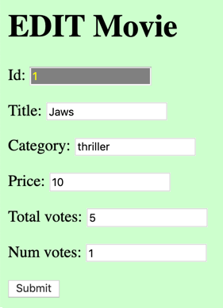

# evote-movie-2020-11-edit-movie

Let's add a link for each listed movie and a form to EDIT a movie:



- add an EDIT column header and link for each Movie listed by Twig template `/templates/list.html.twig`:

    ```twig
    
    <tr>
        <td>{{ movie.id }}</td>
        <td>{{ movie.title }}</td>
        <td>{{ movie.category }}</td>
        <td>&euro; {{ movie.price | number_format(2, '.', ',') }}</td>
        <td>{{ movie.voteAverage }} %</td>
        <td>{{ movie.numVotes }}</td>
        <td>
            
                
            
                (no votes yet)
            
        </td>
        <td>
            <a href="/index.php?action=editMovie&id={{ movie.id }}">
                EDIT
            </a>
        </td>
        <td>
            <a href="/index.php?action=deleteMovie&id={{ movie.id }}">
                DELETE
            </a>
        </td>
    </tr>
    
    ```

- add a new case statement in the `run()` method of Front Controller class `WebApplication`:

    ```php
    switch ($action) {
        case 'editMovie':
            $movieController->edit();
            break;
    
        case 'processNewMovie':
            $movieController->processNewMovie();
            break;
    
        case 'newMovieForm':
            $movieController->createForm();
    ```
    
- add a new method `edit()` to MovieController, this gets the ID from the GET variables, tries to find a record in the DB for this ID, if successful, passes the Movie object to method `editForm(...)`, if NULL an error is show to userL
    
    ```php
    public function edit()
    {
        $id = filter_input(INPUT_GET, 'id');
        $movie = $this->movieRepository->find($id);
    
        // if not NULL pass Movie object to editForm method
        if($movie){
            $this->editForm($movie);
        } else {
            $message = 'there was a problem trying to edit Movie with ID = ' . $id;
            $this->error($message);
        }
    }
    ```
  
- create new MovieController method to display the edit form, passing object `$movie` so Twig can **populate** the form with existing Movie object values:

    ```php
    public function editForm($movie)
    {
        $template = 'editMovieForm.html.twig';
        $args = [
            'movie' => $movie
        ];
        $html = $this->twig->render($template, $args);
        print $html;
    }
    ```

- create the Twig template to display the edit form to the user `/templates/editMovieForm.html.twig`, with form action `processEditMovie`:

    ```twig
    <h1>        EDIT Movie    </h1>
    
    <form action="/" method="post">
        <input type="hidden" name="action" value="processEditMovie">
    
        <p>
            Id:
            <input name="id" value="{{ movie.id }}" readonly>
        <p>
            Title:
            <input name="title" value="{{ movie.title }}">
        <p>
            Category:
            <input name="category" value="{{ movie.category }}">
        <p>
            Price:
            <input name="price" value="{{ movie.price }}">
        <p>
            Total votes:
            <input name="voteTotal" value="{{ movie.voteTotal }}">
        <p>
            Num votes:
            <input name="numVotes" value="{{ movie.numVotes }}">
        <p>
            <input type="submit">
    </form>
    ```
  
    - NOTE: The ID is READONLY - this should not be changed by the user, but we do want to pass it on so we know which DB record to update when processing the form data (alternatively we could have passed ID as a **hidden** form variable ...)

- add a bit of CSS to `/public/css/basic.css` to colour READONLY inputs differently:

    ```css
    input[readonly] {
        background-color: grey;
        color: yellow;
    }
    ```
  
- we need to edit our Front Controller `WebApplication` to invoke MovieController method `processUpdateMovie` when the action received is `processEditMovie`:

    ```php
    public function processUpdateMovie()
    {
        $id = filter_input(INPUT_POST, 'id');
        $title = filter_input(INPUT_POST, 'title');
        $category = filter_input(INPUT_POST, 'category');
        $price = filter_input(INPUT_POST, 'price');
        $voteTotal = filter_input(INPUT_POST, 'voteTotal');
        $numVotes = filter_input(INPUT_POST, 'numVotes');
    
        $m = new Movie();
        $m->setId($id);
        $m->setTitle($title);
        $m->setCategory($category);
        $m->setPrice($price);
        $m->setVoteTotal($voteTotal);
        $m->setNumVotes($numVotes);
    
        $success = $this->movieRepository->update($m);
    
        if($success){
            $this->listMovies();
        } else {
            $message = 'there was a problem trying to EDIT Movie with ID = ' . $id;
            $this->error($message);
        }
    }
    ```

    - we extract the values submitted from the form, then create a Movie object with these values, then use the MovieRepository method `update(...)` to attempt to update the DB record for the item with this ID, and use the Boolean success value to decide whether to list the movies, or display an error message
      
